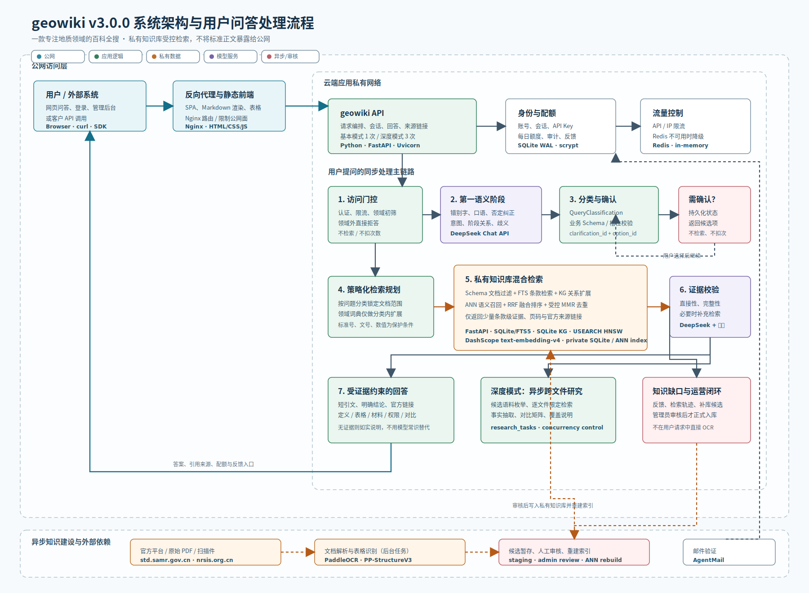

# Architecture

## 架构示意图



该图对应当前 v3.0.1 的实际部署和数据边界：公网只访问 Nginx 与应用 API；私有知识库、标准正文、向量索引与知识图谱不对公网开放。SVG 可直接在浏览器、GitHub 或支持图片预览的文件管理器中打开。

## 1. 目标架构

```text
Browser
  -> Frontend Web App
  -> Backend API
External Agent / Customer System
  -> Public Backend API
Backend API
  -> Application Database
       -> Users / Sessions / Invitations / Email Verification
       -> API Keys / Daily Usage / Quota Adjustments
       -> Conversations / Request Records / Research Tasks
  -> Private Knowledge Retrieval Service
       -> Full-text Search
       -> Vector Search
       -> Knowledge Graph Query
  -> OCR / Document Parsing Worker
  -> LLM Provider
```

## 2. 前端

职责：

- 提供内测和演示用问答输入框
- 展示答案、引用、检索依据和反馈入口
- 管理会话状态
- 选择基本模式或深度模式，并恢复浏览器刷新前仍在运行的深度任务
- 调用后端 API
- 提供邀请码注册、登录和账号状态展示
- 管理用户 API Key、每日配额、调整记录和调用示例
- 管理员处理邀请码、用户状态、每日配额、回答反馈和领域词典候选审核

## 3. 后端

职责：

- 接收用户问题
- 校验浏览器会话或用户 API Key、限流和调用范围
- 按单位原子预留、结算或退回每日问答配额
- 判断问题是否属于矿产资源标准规范相关领域
- 调用知识库检索接口
- 组织检索结果
- 调用大模型生成答案
- 返回结构化结果
- 记录日志和反馈
- 对无证据但领域相关的问题创建异步补库任务

后端处理流程：

```text
Request
  -> Session or API Key authentication / rate limit
  -> Low-cost domain relevance gate
       -> If irrelevant: fixed refusal, no KB/LLM/OCR/web supplement, no quota consumption
  -> Current question + up to 4 recent user questions
  -> First LLM semantic stage: domain typo correction, intent, negation, correction and ambiguity
  -> Immutable QueryClassification + protected business Schema validation
       -> If clarification is required: persist clarification_id, pending slot and resolved slots; return structured options, no KB retrieval and no quota consumption
       -> Option selection resubmits clarification_id + option_id and preserves the original question across multi-level confirmation
  -> Reserve one basic-mode quota unit for the current Asia/Shanghai day
  -> Local KB retrieval
       -> If clause evidence exists: answer with citations
       -> If no clause evidence: return insufficient evidence
  -> Optional web metadata supplement
  -> Optional knowledge-gap task queued for background processing
  -> Consume one unit for answered/evidence-gap results; refund on system error
```

深度模式使用独立异步流程：

```text
Create research task
  -> Domain gate before quota reservation
  -> Shared QueryClassification and ambiguity resolution
       -> If clarification is required: HTTP 200 structured options, no task and no reservation
  -> Atomically reserve 3 units, or 2 additional units for a validated basic-answer upgrade
  -> Persist queued task
  -> DeepSeek research plan
  -> Enumerate governed candidate corpus from Schema/catalog
  -> Per-document scoped FTS/KG/ANN retrieval
  -> AND evidence-group validation plus protected relation-scope guard
  -> Small-batch structured fact extraction with split retry and direct-evidence fallback
  -> Comparison matrix, short quotes, official links, coverage and KB snapshot
  -> Consume on completed/partial/insufficient; refund on system failure or queued cancellation
```

深度研究的模型规划不能覆盖用户明确限定的受保护关系，例如“无限外推”与“有限外推”。事实抽取默认每批 4 条证据；结构化 JSON 截断时拆分重试。任何由直接引文支持的条款都不能仅因模型解析失败而标记为证据不足，最终摘要也不得从“片段未出现”推断“整份文件未规定”。

领域相关性判断应尽量低成本。认证、限流和廉价规则门控先拦截明显滥用；通过初筛后，第一语义阶段的大模型必须在知识库检索前介入，处理领域错别字、口语、省略、否定、纠正和实质歧义。它只形成结构化问题，不使用模型常识替代知识库证据。

### 3.1 应用数据库与每日配额

用户系统使用独立应用数据库，不与私有知识库数据库混用。当前单机内测采用 SQLite WAL；当需要多 API 进程、多节点或更高写并发时迁移 PostgreSQL。

应用数据库包含：

- 用户、密码哈希、角色和账号状态。
- 邀请码哈希、可用次数和有效期。
- 邮箱验证码哈希、有效期、尝试次数、发送冷却和日发送上限。
- 浏览器会话哈希和过期时间。
- 用户 API Key 哈希、前缀和吊销状态。
- 用户长期日上限、当日使用单位、预留单位和管理员追加次数。
- 配额调整审计记录、会话消息、请求 ID、调用渠道和最终消费状态。
- 领域词典正式条目、候选版本、预览状态和不可变审核记录。

密码采用 `scrypt`；会话令牌、邀请码、邮箱验证码和 API Key 均不保存明文。问答前以 SQLite `BEGIN IMMEDIATE` 原子预留配额单位：基本模式 1 个，深度模式 3 个，同一基本答案升级深度模式追加 2 个。领域外拒答不预留；系统异常和排队阶段取消退回。网页会话和账号下全部 API Key 共用配额，日期按 `Asia/Shanghai` 计算。`research_tasks` 持久化阶段、进度、覆盖、研究计划和结果；部分唯一索引保证每名用户只有一个活动深度任务。旧 `API_KEYS` 和 JSON registry 仅作为内部兼容通道，不属于公开用户体系。

AgentMail 可以通过 `AGENTMAIL_PROXY_URL` 使用独立 SOCKS/HTTP 代理。该配置只传给邮件客户端，禁止设置系统级全局代理；DeepSeek、DashScope、知识库和其他请求保持直连。部署可使用受 systemd 管理的 SSH SOCKS 隧道，海外出口仅需 OpenSSH，不与已有代理服务共享配置。

## 4. 知识库服务

职责：

- Schema 与结构化存储
- 标准目录查询
- 全文搜索
- 向量检索
- 知识图谱实体/关系查询
- 用户上传资料的私有库与审核状态管理
- 返回统一格式的证据列表

当前本地/internal MVP 已实现为独立 FastAPI 知识库服务，路由前缀为 `/knowledge/*`，由问答后端通过 `KNOWLEDGE_BASE_URL` 调用。该服务是内部服务，不作为公网产品接口暴露。

v2.0 当前实现：

- SQLite + FTS5：结构化存储、标准目录和全文检索。
- clause-level chunks：标准、规范和政策文件的条款级证据。
- SQLite KG：轻量知识图谱实体和关系。
- API-backed dense embedding：阿里云百炼/DashScope `text-embedding-v4` 写入独立 `chunk_embeddings` 表。
- USEARCH ANN：运行时内存映射私有 HNSW 索引，只从 SQLite 读取 ANN 返回的少量 chunk；不再全量解析 JSON 向量。
- Scoped vector fallback：ANN 缺失或失效时，只允许在已限定到少量候选文档的范围内精确计算；无范围的全库 JSON 向量扫描被禁用。
- Controlled hybrid retrieval：Schema 文档类型过滤、证据关系 FTS、知识图谱和 ANN 多路召回，通过 reciprocal-rank fusion 与意图得分统一排序。
- Intent-aware retrieval：第一语义阶段结合当前问题与最近用户问题形成规范化目标；领域术语归一、查询扩展和证据可回答性校验再处理权限归属、标准适用、材料清单、表格数值和条款差异类问题。
- Workflow relation routing：对“A 已完成、B 尚未取得、还需办什么”的问题，把 A 作为背景、B 作为检索目标；优先路由 B 对应的办事指南和申请材料目录。材料名称可在证据约束下转换为动作，但不得添加证据外的前置审批。
- Authority roles：权限问题分别提取许可证颁发层级、矿业权出让层级和评审备案机关；回答按许可证颁发机关判断，不能把“自然资源部出让”误读为“自然资源部颁证”。
- Query plan：本地确定性规则统一 `1/I/Ⅰ/一类型` 等无歧义写法；DeepSeek 第一语义阶段先校准 `采矿正/采矿证` 等领域输入并识别真实事项，模糊、比较和跨文件问题随后输出受校验的结构化计划。受保护问题保留标准号、文号、数值、事项类型和输出模式，模型不能用自由改写覆盖系统 Schema。
- Conversation resolver：只向第一语义阶段提供最近最多 4 轮用户问题，不回放旧助手答案；当前用户的否定和纠正优先，并可恢复被错误分叉前的有效业务目标。
- Mining-right materials Schema：通用采矿许可证材料问题按新立、延续、变更、注销确认。自然资规〔2023〕4号附件4和 `policy_attachment` 属于受保护候选范围，深度研究按办理类型逐项召回材料，不按发证机关分叉。
- Service-guide tables：知识库表格同时兼容 `matrix` 和 `headers + rows` 两种结构。材料清单按完整性预算保留全部直接相关行和“要求”字段，不能套用普通短引文上限截断后续材料。
- Evidence judge：复杂问题由 DeepSeek 审查前 10 个候选是否直接回答目标关系，并同时生成受证据约束的答案草稿。
- Second retrieval：证据不足时，根据缺口执行最多一次补充检索；复杂问题可以在该轮并发执行最多 2 条受控查询，仍不足则创建异步补库任务。
- Candidate diversity：仅当适用意图的前 5 条候选至少 4 条来自同一文档时，以 MMR 重排已召回的最多 80 条候选；精确标准、表格、附件材料和硬 Schema 范围禁用。
- Retrieval trace：记录规划、各轮检索、ANN 路线、候选来源、证据审查和耗时，不记录密钥。
- Definition slots：定义问题锁定目标术语；复合术语分别补齐直接定义条款，禁用 MMR，并优先使用确定性原文模板。
- Deep research corpus：私有 `/knowledge/research/corpus` 只供后端枚举受治理候选文件；公网仍禁止访问全部 `/knowledge/*`。

Elasticsearch/OpenSearch、ChromaDB/FAISS 和 Neo4j 仍是后续规模化或质量升级方向。Embedding Provider 必须可配置，不使用 `deepseek-v4-flash` 作为 embedding 模型；当前在线 embedding 默认适配阿里云百炼 OpenAI 兼容接口。

接受的知识库架构分三层：

- 最低兼容：结构化元数据 + 全文检索 + 标准目录查询 + 证据检索接口。
- 推荐 MVP：关系型数据库或 SQLite + FTS5 + 本地/对象存储 + 后台 OCR/解析任务 + Knowledge API。
- 增强架构：ChromaDB + 可配置 Embedding Provider + Neo4j + reranker + 混合检索。

外部知识库可以通过适配器接入，但必须转换为本项目的证据格式；缺少条款、页码、来源和质量状态时，问答模块应降级回答。

意图增强检索流程：

```text
User question
  -> domain relevance check
  -> current question + recent user-question context
  -> DeepSeek typo correction, canonical intent, negation/correction and ambiguity judgment
  -> protected Schema validation and optional user confirmation
  -> DeepSeek retrieval planner only when the confirmed question needs semantic planning
  -> validated intent schema and document-type routing
  -> mandatory-relation FTS + KG expansion + USEARCH ANN
  -> reciprocal-rank fusion and candidate diversity
  -> DeepSeek evidence judge / grounded draft for complex questions
  -> at most one refined retrieval round
  -> deterministic high-value formatter or grounded answer
  -> async web/OCR enrichment when evidence remains insufficient
```

第一语义模型不得先生成自由答案再要求检索器为其寻找依据。受控联网补充也必须先取得白名单官方来源的实际文本或元数据、形成可审计证据，再进入答案生成；模型训练知识不能冒充互联网证据。

`domain_lexicon` 在 v2.1.0 由 SQLite 治理表和运行时 JSON 两层组成。内置词条在应用数据库初始化时登记；管理员新增或修改内容先进入候选表。候选记录用户表达、规范术语、意图标签、领域、别名、上下文条件、正向扩展、负面降权词、证据要求、优先级、风险等级、正例和反例。

发布流程：

```text
Feedback / query mining / KB Schema / manual input
  -> candidate draft
  -> administrator completes mapping and risk controls
  -> save as pending
  -> preview current vs proposed behavior
  -> validate every positive and hard-negative example
  -> approve or reject with review note
  -> atomic runtime JSON publication
  -> API and private KB reload by file mtime
```

领域门控、确定性意图和检索扩展使用独立运行开关。通用表达不能单独通过领域门控，除非同时出现受治理的地质/矿业上下文。候选指纹覆盖所有会影响匹配的字段；字段变化会使旧预览失效。正式词条停用或恢复后重新原子发布，并保留完整审计记录。运行时文件默认位于 `data/app/domain_lexicon_runtime.json`，与应用数据库一样属于私有运行数据。

## 5. OCR 与版面解析

OCR 服务用于处理图片型 PDF、扫描件、官方视觉预览和表格型标准页面。它不应阻塞普通问答请求，优先以后台任务方式运行。

推荐备选工具：

- PaddleOCR：中文 OCR 主方案。
- PP-StructureV3：文档版面解析、结构化输出和表格识别。
- TableRecognitionPipelineV2：表格结构识别专项试验。

本地试验环境：

```text
/home/nalanmading/.venvs/codex/bin/python
```

处理流程：

```text
Official visual source / scanned PDF
  -> Page image or page PDF extraction
  -> PaddleOCR / PP-StructureV3
  -> Text, layout blocks, tables, confidence
  -> Page and source mapping
  -> Human/sample validation
  -> Knowledge index
```

OCR 输出至少应包含：

- source_id
- source_url
- page
- text
- layout_blocks
- tables
- confidence
- ocr_engine
- ocr_engine_version
- created_at

低置信度 OCR 结果不能作为强结论依据。

## 6. 联网来源补充

联网模块用于补充本地知识库之外的标准元数据和候选来源，不直接替代本地知识库正文。

来源处理流程：

```text
Question
  -> Local Knowledge Retrieval
  -> If evidence is insufficient:
       -> LLM extracts likely standard numbers/names as search clues only
       -> Official source lookup on std.samr.gov.cn / nrsis.org.cn
       -> Source availability classification
       -> Optional candidate source discovery
       -> Optional OCR task into candidate staging
  -> Evidence merge
  -> LLM answer with source limitations
```

同步问答请求默认不执行完整联网搜索或 OCR。MVP 默认策略是创建知识库缺口任务并快速返回；只有显式开启 `ENABLE_SYNC_WEB_SUPPLEMENT=true` 时，才在请求内做官方元数据补充。

来源可访问性分类：

| source_type | text_access | 用途 |
| --- | --- | --- |
| official_metadata | metadata_only | 确认标准存在、状态、日期、主管部门 |
| official_fulltext | html_text/pdf_text | 可进入条款级检索和回答 |
| official_visual | image_ocr_required | 需要 OCR 后才能作为正文证据 |
| third_party_candidate | unknown/pdf_text/html_text | 候选来源，需校验版本和授权 |
| unavailable | unavailable | 不能支撑条款级回答 |
 
当来源不是 `official_fulltext`，后端必须把限制传给答案生成模块，避免模型把元数据当成正文依据。

大模型训练数据只能用于“推测可能相关的标准线索”，不能作为标准状态、条款内容或结论依据。所有候选标准必须经官方平台或本地知识库验证后才能进入 `sources`。

联网或 OCR 新获得的数据不直接写入正式知识库。系统应先写入候选暂存区，记录来源 URL、标准号、页码、OCR 文本、置信度、触发问题、任务状态和版权/授权备注。管理员批量审核通过后，才允许进入正式知识库索引，供后续用户复用。

知识库缺口任务可以异步、低并发执行。MVP 阶段允许单 worker 或定时任务串行处理，以降低服务器压力。任务处理顺序应优先考虑问题频次、标准明确程度、来源可信度和业务价值。

自然资源领域行标需要额外适配 `nrsis.org.cn`：

- 查询页可通过 `key` 参数按标准号或标准名称检索。
- 详情页可能提供官方全文阅读入口。
- 阅读器可能通过按页 base64 PDF 返回图片型页面，普通 PDF 文本抽取可能为空。
- 这类来源应进入 OCR/版面解析队列，而不是直接交给文本模型总结。

## 7. 模型服务

初期通过 OpenAI-compatible API 调用模型。模型配置放在 `.env`：

- `OPENAI_API_KEY`
- `OPENAI_BASE_URL`
- `OPENAI_MODEL`

## 8. 部署草案

- 前端：由公开 FastAPI 服务提供静态 SPA 资源
- 后端：Python API 服务，仅由 Nginx 反向代理公开
- 应用数据库：独立 SQLite，后续可迁移 PostgreSQL
- 知识库：独立服务，仅监听 `127.0.0.1`
- Redis：限流和后续任务队列
- 域名：指向云服务器入口
- HTTPS：通过 Nginx + 证书管理
- 开放形态：API-first，前端主要用于内测、调试和管理

无域名内测时可通过服务器 IP 的 80 端口访问，但只允许邀请码用户参与。涉及真实账号和 API Key 的公开测试应尽快启用 HTTPS；启用 HTTPS 后将 `SESSION_COOKIE_SECURE=true`。
