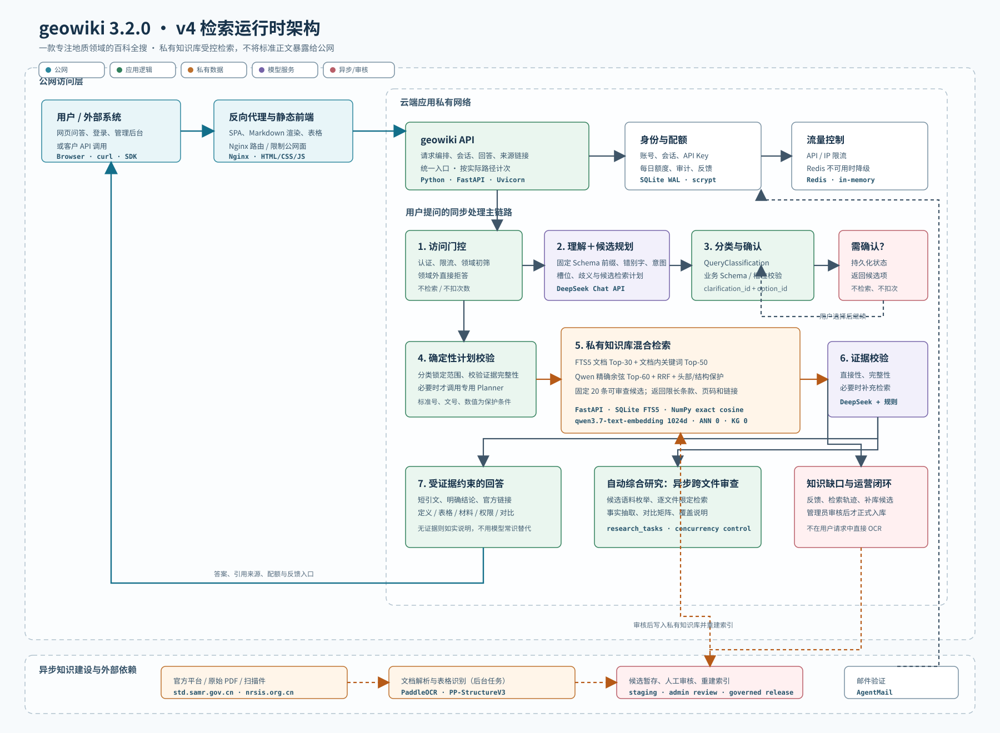

# Architecture

## 当前架构示意图



本文描述当前应用代码和最近一次验收通过的生产架构。应用版本为 `3.2.0`，生产知识与检索运行时为 `v4-hybrid-fixed20-p1fix-v4`。v3 仅保留为回滚资产；当前 v4 不使用 ANN 或知识图谱。

示意图强调组件边界，综合研究分支的连线是逻辑摘要；实际浏览器路由在知识库检索前完成。直接查证进入 v4 fixed-20 检索，综合研究则先持久化异步任务再执行受控的逐文件检索。

生产状态以 `coordination/task_board.md` 的 T086 为准。T085 的 Schema 前移和统一问题理解/检索规划已于 2026-08-03 完成线上部署与独立验收；旧开关仍作为回滚路径保留。

## 1. 系统边界

```text
Browser / API client
  -> Nginx :80
  -> Public FastAPI + static SPA :18080
       -> Application SQLite
       -> Redis rate limiter
       -> DeepSeek-compatible chat API
       -> Private Knowledge API :18081
            -> v4 corpus SQLite
            -> independent FTS5 index
            -> 23,250 retrieval leaves
            -> 23,250 x 1024 Qwen document-vector matrix
            -> v4-only candidate staging SQLite
```

- 公网只访问 Nginx 和公共应用 API。
- `/knowledge/*` 只监听服务器回环地址，Nginx 对公网固定返回 404。
- 原始标准、PDF、OCR、语料数据库、FTS 和向量矩阵均为私有资产。
- 应用数据库与知识库分离，部署知识运行时不得覆盖账号、注册、会话、配额和反馈数据。

## 2. 前端与公共应用层

前端是由 FastAPI 同源提供的静态 SPA，负责：

- 邀请注册、登录、账号和用户 API Key 管理；
- 单一问答入口、歧义确认、会话历史和答案引用展示；
- 自动恢复仍在执行的异步综合研究任务；
- 标准目录、用量、反馈和管理员治理页面。

用户不再手工选择“普通/深度模式”。浏览器 Session 统一调用 `POST /api/ask`：明确问题直接查证；跨文件比较、完整性核验等复杂问题由后端自动创建异步研究任务。用户 API Key 调用 `/api/ask` 时继续保持同步答案合同；需要异步综合研究的外部客户端显式调用 `/api/research/tasks`。

公共 API 负责：

- 浏览器 Session 或用户 API Key 鉴权；
- Redis/内存降级限流；
- 亚洲/上海时区下的配额预留、结算与退款；
- 会话、确认状态、研究任务和反馈持久化；
- 调用私有知识服务并只返回限长、可引用的证据；
- 证据充分时组织答案，证据不足时停止作答。

## 3. 统一问题处理流程

```text
Request
  -> authentication and rate limit
  -> low-cost domain gate
       -> out of scope: fixed refusal, no retrieval and no quota use
  -> current question + at most 4 recent user questions
  -> DeepSeek structured question understanding
       -> typo correction / intent / slots / ambiguity / guarded retrieval plan
  -> deterministic QueryClassification and protected Schema validation
       -> clarification required: persist options and stop before retrieval
  -> browser-session automatic path selection
       -> direct verification: reserve 1 unit
       -> comprehensive research: reserve 3 units and create async task
     API-key /api/ask: retain synchronous answer contract
  -> private v4 retrieval and evidence review
  -> grounded answer or insufficient-evidence result
  -> quota settlement, trace and optional bounded shadow observation
```

当前生产代码把固定输出 Schema 放在动态问题之前，以提高模型前缀缓存稳定性。QuestionResolver 默认同时生成问题理解和检索规划；当确定性完整性校验发现多组 AND 证据却没有独立检索变体时，系统才回退到专用 RetrievalPlanner。模型不可删除用户明确给出的标准号、文号、数值、矿种、业务事项和限定条件。

问题理解器和规划器只形成结构化检索目标，不先生成自由答案。模型记忆、训练数据或假设性结论不能替代知识库条款。

## 4. v4 私有知识与检索运行时

当前运行时固定到经过哈希验证的私有资产：

- 156 份文档；
- 3,645 个页面/非物理来源记录；
- 20,670 个内容单元；
- 23,250 个检索叶节点；
- 独立 FTS5 索引；
- 23,250 个 `qwen3.7-text-embedding` 1024 维持久化文档向量；
- v4-only 候选暂存数据库。

一次普通检索按固定架构执行：

```text
original / governed lexical and semantic query routes
  -> FTS5 document Top-30
  -> document-local lexical Top-50
  + exact-cosine dense Top-60 over the frozen Qwen matrix
  -> equal-weight reciprocal-rank fusion
  -> lexical Top-1 / dense Top-4 head admission protection
  -> governed structural reservation
  -> unchanged-order fill
  -> exactly 20 final evidence candidates
```

关键词和向量是并行路线，不是先后级联，也不取交集。查询 Embedding 使用独立短超时、最多一次重试、SHA-256 键控内存缓存和 single-flight 合并；向量调用失败时安全退回关键词路线。当前对 23,250 行矩阵执行精确余弦搜索，没有 ANN 索引，也没有知识图谱实体或关系参与召回。

结构保留只补充同一表格、明确编号条款族或受控章节中的必要证据。父级导航节点不可直接引用，最终答案仍必须落到可引用的叶节点、条款、表格行或官方来源记录。

## 5. 证据审查与回答

搜到相关文件不等于已经回答问题。系统在生成答案前检查：

- 是否命中具体条款、表格行或明确的官方程序材料；
- 是否覆盖主体、条件、行为、后果和例外；
- 是否遗漏“但是”“除外”“情节严重”等限制；
- 是否需要组合引用多个文件；
- 文件是否现行、可回答以及是否仅为解读材料；
- 数值、单位、方向、表头和表注是否完整。

复杂问题可以调用 DeepSeek 做受约束的证据审查，但模型看不到检索路线分数来替代证据判断。最终自然语言只能使用保留证据中的事实；证据不足时返回 `insufficient_evidence`，不得用模型记忆补写规范原文。

《矿产资源储量技术标准解读300问》可以作为解读材料补充说明，但必须明确标注来源，并服从现行法律、行政法规、政策文件和技术标准原文。

## 6. 异步综合研究

综合研究用于跨文件比较、完整性核验、复杂条件链和成套文件审查：

```text
persisted task
  -> shared QueryClassification and clarification state
  -> governed candidate-corpus enumeration
  -> per-document bounded retrieval
  -> AND evidence-group validation
  -> small-batch structured fact extraction
  -> comparison matrix, citations, coverage and KB snapshot
```

网页由统一入口自动进入该流程并轮询任务；显式研究 API 仍供兼容客户端使用。新任务消费 3 个配额单位，排队阶段取消或系统失败会退款。研究模式可以扩大候选范围和审查深度，但不能重新解释或丢弃已确认的用户条件。

## 7. 应用数据与治理

应用数据库采用 SQLite WAL，存储用户、密码哈希、邀请、邮箱验证码、会话、API Key、每日配额、会话消息、研究任务、反馈和领域词典治理记录。密码使用 `scrypt`；会话令牌、邀请码、验证码和 API Key 不保存明文。

候选材料、联网发现和 OCR 结果必须先进入候选暂存和人工审核，不能直接进入可回答语料。领域词典同样采用候选、预览、正反例校验和管理员批准后原子发布的流程。

账号数据库、运行日志、领域词典运行文件、候选库和知识运行资产全部位于 Git 忽略的私有数据目录。

## 8. OCR 与联网补充

OCR 用于图片型 PDF、扫描件、官方视觉预览和复杂表格，只作为后台治理流程，不阻塞普通问答。OCR 置信度只能作为风险信号，不能直接认定原文错误；修订必须有可见页面、正式全文或人工核验版面作为依据。

同步联网补充默认关闭。启用时也只允许从白名单官方来源取得可审计文本或元数据；元数据不能冒充条款正文。无法获得正文时，应记录知识缺口或候选任务，不生成条款级结论。

## 9. 模型服务

- DeepSeek OpenAI-compatible API：问题理解、必要时的独立规划、复杂证据审查和答案组织。
- DashScope/Qwen：查询 Embedding；文档向量已经持久化，不在每次请求中重建。
- 模型配置和密钥只存在 `.env`/云端环境，不记录在日志、报告或 Git。
- 固定 Schema 前缀、有限 Token 预算、确定性校验和功能开关用于控制成本及回滚。

## 10. 生产部署与回滚

当前单机部署为：

- Nginx：公网 80；
- QA API 和 SPA：`127.0.0.1:18080`；
- 私有 Knowledge API：`127.0.0.1:18081`；
- Redis：限流；
- 应用目录：`/opt/geowiki`。

v4 代码或运行时更新只允许使用 `scripts/deploy_v4_cloud.sh deploy`。该流程保留远端 `.env` 和应用数据库，先建立时间戳回滚点，再同步显式代码和哈希固定的 v4 资产，远端预加载通过后依次重启知识服务和公共 API。

`scripts/sync_cloud.sh` 是旧 v3 bootstrap，可能恢复 v3 数据、ANN 和旧环境，不得用于当前 v4 的日常部署。

## 11. 历史组件说明

仓库仍保留 v3 SQLite KG、USEARCH ANN、`text-embedding-v4`、旧双模式前端和相关实验脚本，以支持历史回归或紧急回滚。它们不是当前生产实现。历史发布说明和实验报告应按其当时快照阅读，不应据此判断现行服务是否启用了 ANN、KG 或人工模式选择。
